# Wired & Wiser

## Introduction

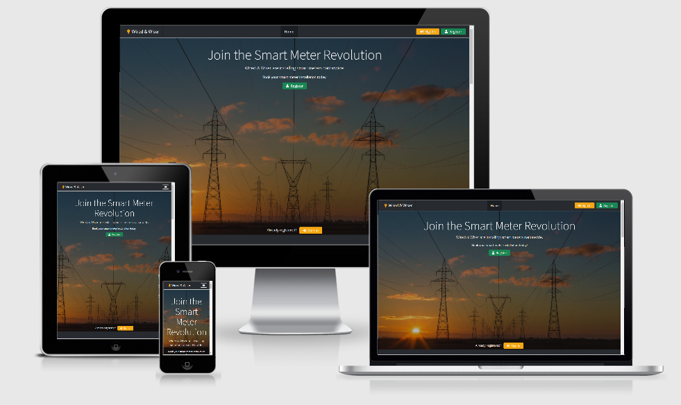

My website is aimed at users curious about Smart Meters.  Smart meters are electricity meters which automatically send consumption data to suppliers to allow accurate billing while providing customers with an in-home display allowing them to monitor consumption in real time.  My website provides people who are curious about smart meters with information on what they are and how they work.  My goal is to encourage visitors, both residential and commercial, to my website to book a smart meter installation with my fictional company “Wired and Wiser”.

The website allows users to sign up with a few personal details.  Once signed up and signed in, users can then book a smart meter installation by providing details of their electricity meter.  From the Account page which users see when they sign in, they can create new bookings and view, update and delete existing bookings.  They can also update and delete their account details.

This is a fictional service since in the British energy industry, customers can only request meter exchanges via their electricity supplier.  My imagined service would see my fictional company sit between customers and their suppliers where for users who book through my website, “Wired and Wiser” take on responsibility for exchanging their existing meters with a smart meter and will then inform their supplier.

My published website can be found [here](https://wired-and-wiser.herokuapp.com/).

My GitHub repository can be found [here](https://github.com/LukeGarnham/Wired-and-Wiser-MS3).

 
## UX

### User stories

I have heard about Smart Meters and I want to:
-	Find out more information about them.
-	Book smart meter installation appointments for my electricity meter(s) to be replaced with a Smart Meter(s).
-	Update my installation booking information.
-	Cancel my installation booking.
-	Change my account information including my password.
-	Delete my account.

As the website owner, I want to:
-	Inform visitors about smart meters.
-	Attract as many smart meter booking installations as possible.

### Preparation & Planning

Having worked in the energy industry, I am aware that there are many interconnected processes and chains of information passed via numerous parties.  I could have made my project a lot more complex as there are many other parts to the process of a meter installation which I could have included.  For example, if my fictitious company were real, they would have a team of qualified engineers who would need to be assigned to each meter installation booking.  Each engineer would have rotas with certain availability and cover certain regions within Britain.  These would need to be considered if users were to be given the choice to select their installation date.  Once meters are installed, the next step for my fictitious company would be to inform the supplier perhaps via an automated email being sent with information about the meter installation such as date of meter exchange, final meter read, new meter serial number.

I wanted to keep my project simple and manageable and the steps mentioned above could be future developments.  I have opted to focus on the exchange of information between customers and my fictional meter installation company, Wired and Wiser.  My project consists of:
- Home page:  This provides users with information about smart meters and hopefully entices them in to booking an appointment to have one installed.
- Register page:  Users can register with my website.
- Sign In page:  Registered users can sign themselves in.
- Account page:  This is the page users a directed to when they sign in and it shows them any booking and account information.
- Booking page:  Signed in users can book their smart meter installation appointments.
- View Booking page:  Users with a booking can view the details about it.
- Update Booking page:  Users can amend booking details and delete/cancel the booking.
- Update Account page:  Users can amend their account details and delete their account which also deletes/cancels any bookings they've made.

For this, two collections are required in my database: one for storing user information and one for storing meter installation booking information.  The users email address will act as a primary key in the *users* collection and will be used to link users to their records in the *meter_installs* collection.  I have allowed users of my website to select an installation date that suits them.  I drew the plan for my database using [app.diagrams.net](app.diagrams.net) – the plan is below:

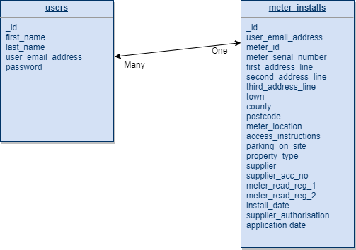

Whilst both collections have an "_id" field which is unique for each record, the user_email_address must also be unique within the *users* collection and the meter_id record in the *meter_installs* collection.  Users will use their email address to sign into the website and will be used to distinguish between users hence why this should be unique.  Each meter point has a unique meter ID (known as an MPAN in the energy industry) and since I don't want to have more than one meter installation booking for the same meter, I want the meter to be unique in the *meter_installs* collection.

## Features

### Existing Features

#### Database
User and meter installation booking data is captured in a MongoDB database.  My database is called “wired_and_wiser”.  It contains two collections as defined above; *users* and *meter_installs*.

#### Register Form

My Register form contains 4 fields: first name, last name, email and password.  The primary key is email.  These fields are stored within my *users* collection.  The first name, last name and email address are all stored in lowercase.  The password is hashed and salted using werkzeug’s **generate_password_hash** method before being stored in the *users* collection.

Before adding a new user to the *users* collection, I check the database to see if the email address provided already exists within it.  If it does, then a flash message informs the user.  Otherwise, the user’s details are added to the *users* collection and a flash message informs them that they have successfully registered.

I added a link under the form which directs users to the sign in page.  This is in case a user tries to register but has actually already done so previously.  A flash message informs them that an account already exists with the email address they have tried to register with and so they can quickly direct themselves to the sign in page.

All fields are required before the user can submit the form.  This is indicated by an asterisk next to each form label and also in the placeholder text.  To add some further defensive design to my registration form, I applied a maximum length of 30 to the first and last name fields.  This should be sufficient for most users as I don’t think many users would require more characters.  I have also limited the first and last name inputs to just letters and a hyphen (-) for hyphenated names.  Numbers, spaces and other special characters are not required for people’s names.  I chose not to limit the length or characters in the email form.  I felt the default validation for email fields is sufficient.  For the password field, I set the minimum length as 6 and a maximum length of 15 characters.  I did not restrict the use of characters for the password field as allowing users the full choice of characters means more secure passwords can be chosen.

I inform users of the defensive design built into the form through **small** messages underneath the **input** fields which explain the requirements to pass the form validation.

The form was built utilizing various [Bootstrap form classes](https://getbootstrap.com/docs/4.5/components/forms/).  The layout is responsive; on small screens (up to 768 pixels width) the labels appear above the input fields with all text centred.  On a medium screen (768 pixels width upwards), the labels and inputs appear side by side with text justified to the left.

#### Sign In Form

The Sign In form is similar in design to the Register form.  There are two fields; one for the users email address and one for their password.  I check to see if there is a match for these two fields in the *users* database.

When the user submits the form, I first check whether the email address exists in the *users* collection.  If so, I then compare the password provided to the one stored in the database.  Since the password stored in the database has been hashed and salted, I utilize werkzeug’s **check_password_hash** method to compare the two passwords.  If they match, then the user is redirected to the Account page and a flash message appears welcoming them back.  The users email address is saved in the session variable.  If either the email address isn’t found in the *users* collection or it is but the passwords do not match, then the user is redirected back to the Sign In form (with all fields cleared) and a flash message informs that either the email address or password entered is incorrect.  Nothing gets saved in the session variable.  By not informing the user which field contains incorrect information, it makes it harder for someone trying to hack into an account as they will not know whether the email or password they’ve used is incorrect.

The form contains defensive design elements.  I have used the defensive tools provided in HTML5 rather than any custom checks besides those detailed above.  Both fields are required before the user can submit field.   There are no restrictions applied to the email address field besides the default checks performed on email inputs.  On the Register form, there is a minimum limit of 6 characters and a maximum limit of 15 characters for the password the user must provide.  In the sign in form, I decided to remove these limitations.  The reason for this is that the user will already know their password which had these restrictions applied upon creation.  The password check using werkzeug’s **check_password_hash** method validates whether the password entered matches the one provided when the user registered their account.  Unlike the Register form, I chose not to include any on-screen tips advising the user of any restrictions.

Below the form, there is a link to the Register form.  I added this in case a user accidently navigates to the sign in page when they do not have an account yet.

I have used a slightly different background image to keep the site visibly appealing although on smaller screen sizes (up to 768 pixels width), the background image is mostly hidden behind the card containing the form.

#### Account Page

When the sign in form is successfully submitted, the users email address is saved in the session variable and the Account page is loaded.  Since the Account page is dependent on the users email address being saved in session storage, I added some defensive design by including an if statement in the Python code which checks the users email address exists in session storage before the Account page is loaded.  If for any reason the users email address does not exist in session storage, the user is redirected to the Sign In page.

The Account page contains a card with a Manage Bookings tab and Manage Account tab.  Each of these views display information from the collections in my database.  The Manage Account section shows the users details from the *users* collection apart from their password which is not displayed for security reasons.  The Manage Bookings tab contains high level information about any meter installation bookings the user has and unpacks some data from the *meter_installs* collection.  This data is displayed in a table and is sorted first by install_date (starting with the earliest) and then by the first_address_line.  This is so that a user with multiple meter installation bookings (such as a business with several premises) can view them based on how soon they will be installed – if there are multiple installations on the same day they can see them listed by the first line of the address.  The information required for these tabs is passed through via two variables.

I search the *users* collection for one result using the find_one method to find one user with the users email address which is passed through to the function Python account function.  Due to the defensive design added to the Register form, there will only be one result which matches the users email address since it is the primary key.  I assign the resulting dictionary to the variable user.  Before I pass this through to the template, I remove (**pop**) the password off the dictionary.  Although the password retrieved from the collection has been hashed and salted, I felt it would improve security to not pass this through.

Next, I use the users email address to find all records in the *meter_installs* collection with the corresponding user email address.  I assign the list of results to a variable called bookings.  The results are sorted by install_date and then first_address_line.

Of course, if the user does not have any bookings then there is no data to unpack.  Therefore, before unpacking the booking data, I conduct an **if** statement using Jinja to check the length of the bookings list.  If the length of the list is greater than 0, then I unpack the data.  Otherwise, if there are no bookings (i.e. the bookings list length is 0), I display a message to the user advising them that “You don't currently have any meter installations booked.”.

For the bookings data, I opted to only display a small amount of information on screen.  The reason is that there is a lot of information for each booking and for users with multiple bookings, there would be a lot of information to display on screen.  Instead, I deemed that the first line of the address, postcode, meter ID and installation date would be the key pieces of high-level information to display on this screen.  On small and medium screens (up to 992 pixels width), the postcode and meter ID columns are not displayed.  Even then, not all of the information can be seen on smaller screens so there is a horizontal scroll so users can still see all of the information rather than it spilling over.

As well as unpacking the bookings data on the page, I also opted to display the number of bookings next to the tab title using the length method to improve user experience.

I also included two links for each booking; one to view the booking and one to edit the booking.  On small screens, only an icon is shown but on medium screens (786 pixels width upwards), text appears alongside the icon.  This is to save horizontal space on smaller screens.

On the Manage Account tab, I display the users first name, last name and email address.  I include links here for the user to Update Details on their account and to Delete Account.

Lastly, I decided to swap the styles for the active and not active tabs around.  The original styles inherited from Bootstrap had the active tab with a light grey background colour and the inactive tab with a black background colour.  This was the inverse of the effect on the header navbar.  Furthermore, I also felt that this made the active tab look inactive and vice versa which as I was testing did not feel like a good user experience.  Using the Google Chrome inspection tools, I copied the Bootstrap rules and placed them in my CSS file.  I then swapped the styles around between the two rules thus inverting the styles.  I also added a hover effect to the inactive tab so that the text appears in orange – this is a style applied throughout my website and I wanted to include it on the tabs here too.

#### Book Smart Meter Installation Page

There are multiple fields on the booking page.  Below is a summary of each:

**Meter ID**:  This field is required, and it is restricted to numbers only.  The meter ID should be 13 digits long so there is a minimum and maximum length of 13 applied to restrict users submitting anything other than 13 numbers.  A small note beneath the field informs users of this.  Each supply point has a unique meter ID which is why as an installer, I need this number.  I have provided an info icon which launches a modal to explain to users what the meter ID is and where they can find it.

**Meter Serial Number**:  This is not a required field.  I have applied a maximum length of 12 characters because although there is no fixed length for a meter serial number, they are not longer than this.  The meter serial number is not necessarily unique but would be nice to know as the installer hence why I have included the field but not made it a required field.  I have provided an info icon which launches a modal to explain to users what the meter serial number is and where they can find it.

**Address**:  The address is split into 6 inputs to reflect each line of a user’s address.  The first line, town, county and postcode are all required fields.  For all fields except the postcode, I imposed a maximum limit of 50 characters.  I felt that this should prevent malicious users submitting spurious information to my database whilst providing users with enough characters to detail their address properly.  For the postcode, I imposed a minimum length of 6 and a maximum length of 8 characters since all UK postcodes fall into this range (including the space in the middle).

**Meter Location**:  This is a text-area field with no restrictions applied to the user input.  It is a required field because the installer will need to know where in the property the meter is located.

**Access Instructions**:  This is a text-area field with no restrictions applied to the user input.  This is not required but allows users to provide some additional information about accessing the property which may be useful to me as the company installing the meter.

**Parking**:  This is a required field and is simply a select input giving users the choice of yes or no.

**Property Type**:  This is also a required field requiring the user to select either residential or commercial.

**Supplier**:  This is a required field.  I considered making this a select list as well.  However, suppliers are constantly entering and exiting the market place so it would become a separate task in itself to keep this list updated.  Therefore, I left it as a text field for users to populate.  I only want the supply company’s name so I thought it would be beneficial to cap the amount of characters a user can input into this field.  Therefore, I have applied a maximum length of 30 characters.  As the installation company, I will need to liaise with the supplier to notify them on the meter being replaced.

**Account Number**:  It would be beneficial to me to know the supplier account number when I inform the supplier that my company has been contacted to replace the meter for the user.  As something that would be nice to have but not essential, the field is not required.  Account numbers can contain letters so I chose not to restrict the characters users can input.  I applied a maximum length of 20 which will be sufficient for an account number; whilst they can vary in length, they are typically no more than 12 characters.

**Meter Reads**:  I have provided two fields for the users to submit meter reads.  This is because meters typically have either one register for consumption 24/7 or two registers; one for day and one for night-time usage.  Neither of these fields are essential which is why they are not required.  If the user does provide them, I can pass them onto the supplier to ensure their bills are accurate.  Meter registers are typically 6 digits long however, I have provided a maximum length of 8 characters just in case a user has a meter with more digits than usual.  I have restricted the input to only numbers.

**Installation Date**:  This field is required as I need to know when the user wants their meter installed.  Using jQuery UI and jQuery, I set up this input field to have a calendar appear when the user clicks or tabs into this input field.  I chose a jQuery UI theme (darkness) which closely matches the colour scheme of my website.  I linked to the version 1.12.1 darkness theme CSS theme using a CDN I found on [this website](https://cdnjs.com/libraries/jqueryui).  I linked to the jQuery UI version 1.12.1 JavaScript files via a CDN also found on [this website](https://code.jquery.com/).  Using the built in [jQuery UI options](https://api.jqueryui.com/datepicker/), I set up the earliest install date to be 30 days from today’s date.  This is because as an installation company, I need time to plan my workload and cannot have users booking in a meter installation at 24 hours’ notice.  I also restricted users from selecting a date beyond 2 years into the future since I wanted to impose an upper limit to the range of time we can take bookings.  I also restricted installations from being booked on a Sunday to reflect the business opening hours.  I used the jQuery UI options but referred to [this solution](https://stackoverflow.com/questions/31770976/disable-specific-days-in-jquery-ui-datepicker) I found online.

**Authorisation**:  The last part of the form is a checkbox asking the user to authorise Wired & Wiser to complete the installation and to contact their supplier.  As a meter installed, I need to liaise with the supplier to inform them of the new meter details and pass on final meter reads from the old meter to maintain accurate billing for the customer.  Due to GDPR, I need some form of authorisation to speak to the supplier on behalf of the customer.  This checkbox acts as that authorisation.  Without this authorisation, my company cannot install the new smart meter.  Therefore, using jQuery I prevent the user from submitting the form unless this checkbox is checked/ticked.  This means that all bookings I receive will have this authorisation granted.  If a user doesn’t give this consent then they cannot complete the booking.

When the form is submitted, the record is added to the *meter_installs* collection.  However, I first check to see if there is an existing record in the collection with the same meter ID.  Whilst the “_id” field is the unique and primary key, I also want the meter ID to be unique in my collection.  The reason for this is that the meter ID acts as a unique identifier of each meter point in the electricity industry.  As a meter installation company, I don’t want to have two bookings for the same meter ID.  If someone tries to enter a record with a meter ID which already exists in my collection, a flash message informs them and the record is not inserted in my collection.

#### View Booking Page

From the Account page, under Manage Bookings, users can click the View button.  The View Booking page shows all information related to a particular booking.  The page template takes a unique booking ID as an argument.  The entirety of the booking details are retrieved from the *meter_installs* collection and this is passed through to the template.  The template unpacks this date onto the page using Jinja next to corresponding labels.  Dates are formatted to “dd/mm/yyyy” strings.  The parking_on_site and property_type are capitalised to improve the visual look. 

The page contains 3 options; Update Booking, Delete Booking or return Back To Account.  Before the booking is deleted, a modal fades in asking the user to confirm whether they want to proceed.  I included this to improve user experience; I didn’t want a user to accidentally click the delete booking and have no chance to rectify this prior to the booking being cancelled.

When a user confirms they want to cancel their booking, the delete_booking function is called.  The (python) delete_booking function takes the booking ID as its only argument.  Since the booking ID is unique, I use the delete_one method to delete the record with the corresponding booking ID.  A flash message informs the user that their booking has been successful and they are redirected to the Account page.

#### Update Booking Page

The Update Booking page was initially a copy of the booking page.  In here I unpack the data into the form using the **value** attribute in most cases.  For required fields, I know that a record would exist in my *meter_installs* collection so I unpack it as the **value** in the field.  However, for the fields which aren’t required, I used **if** statements to either display the value retrieved from the *meter_installs* collection if there is one or where there isn't, placeholder text.

Users are free to update all fields that appear on the booking form.  The required fields remain the same and the user must once again tick the authorisation checkbox before they can submit their changes.  The data validation rules imposed on this form mirror those from the Booking form.

The installation date can be left as it is but if the user wants to edit it, then they must give 30 days’ notice once more.  I have updated the note underneath the field to inform users of this.

When the form is submitted, I check once more to ensure that there are no other bookings in the *meter_installs* collection.  This is in case the user has updated the meter ID.  I want to ensure that the meter ID is unique within my collection since they are a unique identifier used within the electricity industry.

The application date is not updated when a booking is updated.  Instead, I decided that the original application date should be maintained.

I have also included an option for users to delete the booking.  As with the View Booking page, there is a modal which ensures users must click twice to say they want to delete a booking.  This helps prevent bookings from being deleted accidentally.

There is also a button which enables users to return to the account screen.

#### Update Account Page

The Update Account page was originally a copy of the Registration page.  The users account details are retrieved from the "users” collection and passed through however for security reasons I remove (**pop**) the password off beforehand even though it has been hashed.  The form field **placeholders** have been replaced with the **values** of the first name, last name and user email address retrieved from the *users* collection.  This allows users to amend these fields.  The password field still contains the original **placeholder** but I have changed the note underneath informing users that in order to update their details, they must submit their current password.  The same defensive design is applied to all fields as in the Registration page.

When the form is submitted (POST method), I check that the password matches the existing password using the werkzeug’s **check_password_hash** method.  If not, the user is redirected back to the Update Account page with a flash message informing them that the password they entered is incorrect.  Otherwise, I create a dictionary called update_user and assign the form values to keys with the exception of the password key to which I assign the existing password.

Next I check to see whether the user has updated their email address.  If so, then I check to see whether the new email address the user has submitted already exists in my *users* collection.  I don’t want users to be able to change their email address to one which already exists in the users collection.  If there is already a record with the new user email address a user has submitted, a flash message informs them and they are redirected to Update Account page.

Otherwise, if they have changed their email address to one which still remains unique within the *users* collect, there are two extra steps I need to take.  Since all meter installation bookings in the *meter_installs* collection contain the users original email address, I need to update this field.  If I don’t do this, then the Account page will not return/show any bookings they have made.  By referring to [this webpage](https://www.w3schools.com/python/python_mongodb_update.asp), I use the **update_many** method to update all meter install records which have the users old email address in the user_email_address field.  I then update them with the new email address using the **$set** method.  Secondly, I also update the user email address that is saved in session storage.

Regardless of whether the users email address has changed or not, I then use the **update** method to find a record in the *users* collection with the users unique id and update the record to the update_user dictionary.  I could have used the users original email address to find their unique record in the *users* collection but decided it would be better practice to use the id.

Once the form is successfully submitted, I redirect the user back to the Account page and display a flash message informing them that their account details have been updated.  They can then see their updated account details by checking the Manage Account tab.

#### Delete Account

From both the Account and Update Account pages, I have included a Delete Account button.  This initially launches a modal since I don’t want users to accidentally click this and have their account deleted.  In the modal, as an added layer of defensive design, the user must enter their password before confirming that they want to delete their account.

When the user does this, the (Python) delete_account function is called.  This uses werkzeug’s **check_password_hash** method to check that the password entered by the user matches the hashed one stored in the *users* collection.  If not, then the user is returned to the Account page and a flash message informs them that the password they have entered is incorrect.  If the user enters the correct password, then it deletes both the users record in the *users* collection and all bookings in the *meter_installs* collection with the users email address.  Since there could be multiple bookings made by the user, I use the **delete_many** method which I read about on [this website](https://www.w3schools.com/python/python_mongodb_delete.asp).  To delete the user from the *users* collection, I use the **delete_one** method and use the users id to find and delete the correct record.  I could have used the users email address since this is also unique in the *users* collection but opted to use the id.  Finally, I also remove the users email address from session storage.  The user is then directed back to the Register page.

### Features Left to Implement

#### Scrollspy

During development, I attempted to add a scrollspy on the home page which had links to the About, What, Why & How sections.  I placed it below the jumbotron but applied a sticky position rule to it so that it sat beneath the nav bar when the user scrolled down the page.  This created a problem on small and medium screens (up to 992 pixels width) since the nav items sit behind a collapsible button; when the button was clicked and the nav items expand down, the scrollspy stayed stuck below the navbar and overlapped with the nav items.  I decided to remove this since it was not an essential part of my project and I didn't have the time to find a solution.

#### Address Finder

Another feature I would like to implement is an address finder.  I found [this API](https://getaddress.io/) which would allow users to enter their postcode and then returns a list of addresses associated with it for the user to select from.

#### Reset Password

Another feature I didn't have time to implement was to enable users to reset their password.  On the Update Account page, I would like to add an option for users to edit their account.

### Known Issues

- The FavIcon does not appear on the Account, Update Account, View Booking & Update Booking pages.  I'm not sure of the reason for this.  This is a minor issue and doesn't have an overall impact on the user experience or functionality of my website in my opinion.  I will try to deploy a fix in future.
- When a user enters invalid data into a form (such as trying to book a meter installation for a meter ID which already exists in the *meter_installs*collection) a flash message informs the user of the issue and the form is reloaded.  As a result, this means that any data the user had input is lost.  This is not good user experience and I would like in future to identify a solution which does not result in the form data being reset.

## Technologies Used

### Bootstrap & Bootswatch

[Bootswatch](https://bootswatch.com/) has a number of themes which are built upon the Bootstrap library.  I chose the theme call [slate](https://bootswatch.com/slate/) as a basis for my project.  The theme has a strong dark colour palette based around the hex colour #272b30.  At the time I started my project, Bootstrap v5.0 had just been released.  However, the latest version the Bootswatch themes were built for was Bootstrap v4.5.3.  To avoid any possible conflicts, I opted to use [Bootstrap v4.5](https://getbootstrap.com/docs/4.5/getting-started/introduction/) in my project.

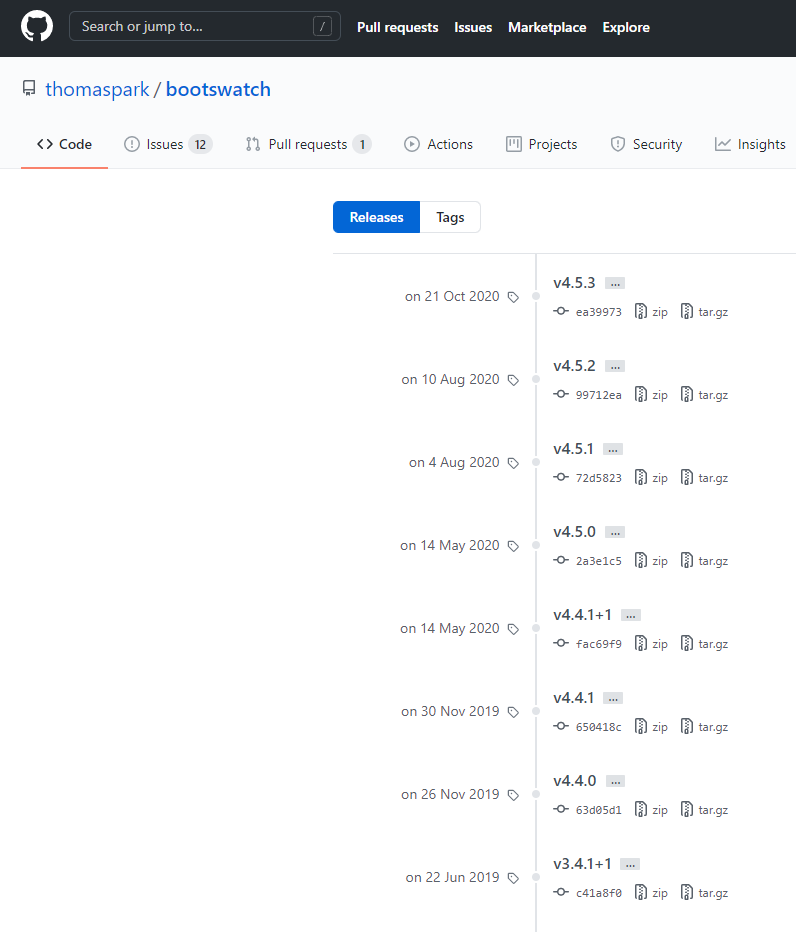

Rather than use the Bootstrap CDN link, I used the [Bootswatch link](https://www.bootstrapcdn.com/bootswatch/) for the slate theme.  This is placed in the **head** element of my base.html file.

### jQuery

I used jQuery to help write bespoke JavaScript code.  I used the latest version available; version 3.5.1 which can be found [here](https://code.jquery.com/).  The uncompressed CDN link is placed in the bottom of the body in the base.html template thus it is extended to all other pages.  I used this for the datepicker widget on the Booking form and Update Details form.

### jQuery UI

I used the [jQuery UI library](https://code.jquery.com/) to import the ui-darkness theme.  Rather than download the CSS file for the theme, I imported it via a CDN link in the **head** element of the base.html file.  I found the CDN link for the ui-darkness/jquery-ui.min.css file [here](https://cdnjs.com/libraries/jqueryui).  I did this to style the datepicker widget on the Booking form and Update Details form.

### FontAwesome

I used [Font Awesome](https://fontawesome.com/start) to provide icons throughout my project to improve UX.  The CDN link for Font Awesome in the **head** element of my base template.

### Google Fonts

I imported two fonts from [Google Fonts](https://fonts.google.com/) to overwrite the Bootswatch fonts.  I imported [Open Sans](https://fonts.google.com/specimen/Open+Sans) which I applied to the body and [Noto Sans JP](https://fonts.google.com/specimen/Open+Sans) which I applied to headers.

## Testing

### Bugs / Problems Encountered During Development

During development, I frequently manually tested the project, especially after implementing something new.  Below are problems I encountered and fixed during the development of the project.

#### NavBar

The original code for my **nav** element was copied from [Bootstrap](https://getbootstrap.com/docs/4.5/components/navbar/#toggler).  I modified this code to achieve the final result present in my project.  The first change I made was to keep the background colour consistent with the slate background colour in the body.  I made the text white as well to ensure strong contrast between text and background colour.  These changes were achieved simply by removing the “navbar-light” and “bg-light” Bootstrap class names from the **nav** element.  This created a problem with the navbar toggler icon; the default icon image did not contrast well with the slate background: 

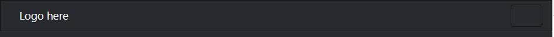

To resolve this I replaced the Bootstrap navbar-toggler-icon with the [Font Awesome bars](https://fontawesome.com/icons/bars?style=solid) icon.  I applied white font and also a white border to the toggle icon.  Finally I wrote some custom CSS to apply a white border to the bottom to achieve this final result:

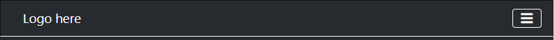

When setting up the links in the navbar, I wanted to have some links which appear as call to action buttons on the right side on large screens.  To achieve this I used the [Bootstrap display properties](https://getbootstrap.com/docs/4.5/utilities/display/) so that the call to action buttons are hidden until the screen size is large (992 pixels width upwards) at which point the navigation links are hidden from the unordered list in the collapsible navigation menu.  This results in the following view on screen sizes up to 992 pixels wide:

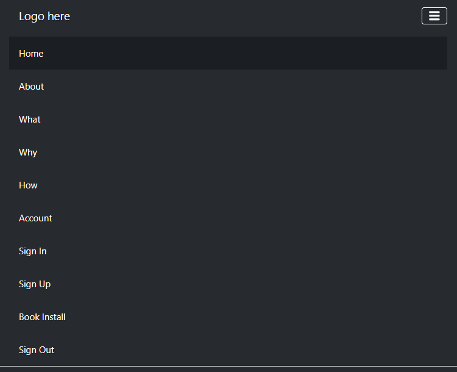

And this was the result on large screen sizes (992 pixels width upwards):

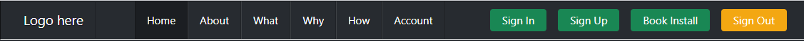

Later in the project I opted to rename Sign Up to Register.  I felt that the Sign Up and Sign In options were quite similar and I wanted to distinguish their purposes.  I felt that "Register" would better inform users that the purpose of that button/call-to-action is to register with the website and thus their interest in getting a smart meter.

I also subsequently removed the About, What, Why and How links since these are all sections on the Home page.  I also used Jinja template language to hide and display the Sign In, Register, Account, Booking Install and Sign Out links according to whether the user is signed in or not; I checked whether their email address is saved in the session variable to achieve this.

I decided to fix the navbar to the top of the page using the Bootstrap “fixed-top” class.  This caused all of the elements on the page to overlap with the navbar.  To solve this, I added a custom CCS rule “padding-top: 56px” to the <body> in order to shift all other elements down the page below the navbar.  The navbar is 56px in height on large screens (992px width and greater) but dropped to 54px in height on smaller screens when the navigation elements dropped behind the navigation toggler.  I added a custom CSS rule to the navbar of “height:56px” to ensure there was never any gaps between the navbar and content.  I also had to apply a background-color to the navbar since this was transparent by default meaning content could be seen behind it when scrolled.  I did this by adding the custom class ‘slate’.

#### NavBar - Active Class

Another issue I noticed as I was developing my project was that the active class was assigned to the index (home) page and was not updating when I clicked on different pages.  This was because the header bar is defined within the base.html template and is extended to all other pages.  Within the base template, the active class was assigned to the Home nav-item.  I turned to Google for a solution and found [this one](https://stackoverflow.com/questions/55895502/dynamically-setting-active-class-with-flask-and-jinja2).  Using a Jinja if statement in the class list for the nav-items, I can dynamically change the active status by setting the active_page variable on each of the html pages.

#### JumboTron

I wanted the jumbotron to have an overlay, so I created a custom class called ‘mask’.  To ensure that the mask overlays the entire jumbotron at all times, I applied “position:relative” to the jumbotron and “position:absolute” to the mask.  The ‘mask’ class is used on most images throughout my project.

The call-to-action is to encourage users to sign-up to the website.  When I created the call-to-action content for the jumbotron, I initially created this within the mask **div**.  The result was that the call-to-action was also overlayed by the mask:

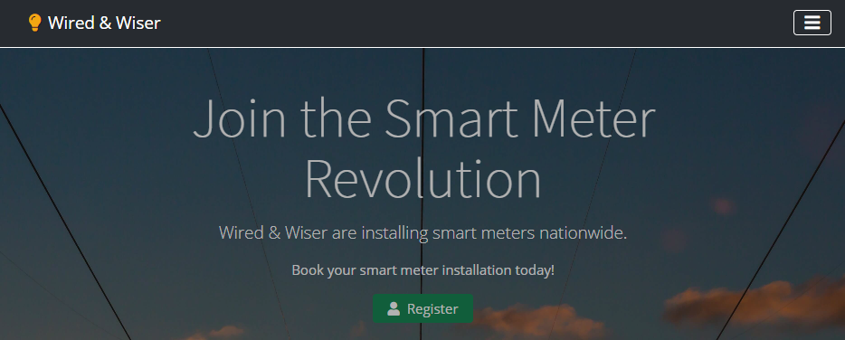

To overcome this, I applied the Bootstrap class “position-relative” to the container **div**.  This brought the call to action in front of the overlay:

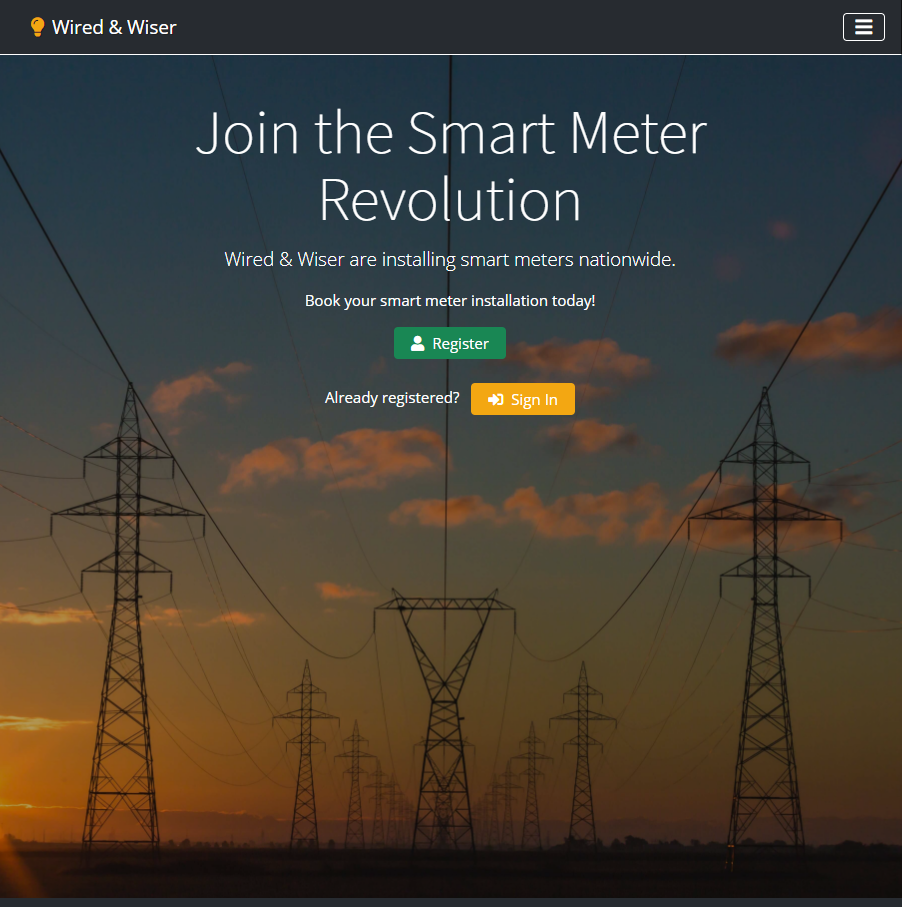

I also wanted to have a sign in button for users who had already registered but I wanted to separate this from the register button.  I used custom CSS to position it how I wanted and achieve the final result.  For the sign-in **div** with class name “.jumbo-bottom”, I applied “position:absolute” and “bottom:10px” to move the sign-in button to the bottom.  To center the **div**, I referenced a solution provided on [this website](https://medium.com/front-end-weekly/absolute-centering-in-css-ea3a9d0ad72e).  This is the end result:

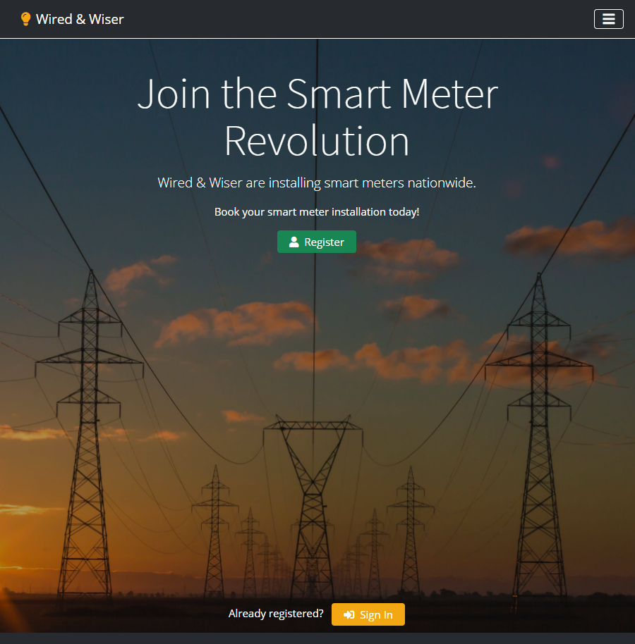

#### Python Date Format

As I was linking the frontend booking form to the backend MongoDB database, I came up against an issue with the format of the dates.  The booking form passes two dates to the *meter_installs* collection.

The installation date is selected by the user in the form.  This was being passed to the backend as a string in the format “yyyy-mm-dd” (although once I deployed the datepicker, I was able to change the format to “dd/mm/yyyy”).  I also pass on the application date.  This uses the datetime.now() function which I imported from the datetime module (**from datetime import datetime**).  This was being passed to the backend in a datetime format.  MongoDB recognised that the installation date field is a string but the application date was recognised as a date type:

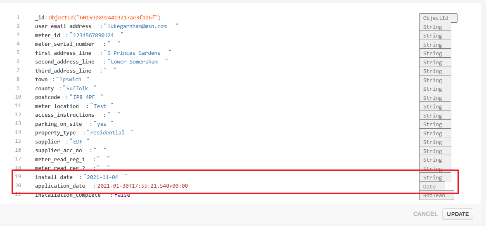

I decided I wanted any fields with a date in them to be formatted as the same type.  Therefore, I opted to change the installation date into a date type.  Within my (Python) book function, I changed the format of the installation date that is passed to the *meter_installs* collection.  I did this using **strptime** method which I [read about here](https://www.programiz.com/python-programming/datetime/strptime).

Another reason I wanted to ensure the installation dates are all stored as the same type is that they are sorted in install date order when they are passed to the Account page.  If the installation dates were stored as string, I don't know whether the sort would have worked correctly.

Having achieved consistency across the dates being entered into my backend, I now noticed another issue.  The installation dates are returned to the Account page under the Manage Bookings tab.  These were now being returned in there full datetime format rather than my preferred format of “dd/mm/yyyy”.  To correct this, I used a method to change the date type into a string type and into my preferred format.  I used the **strftime** method which I [read about here](https://www.programiz.com/python-programming/datetime/strftime).  I could have changed the date format before passing the bookings through to the Account template however, I decided a better solution was to simply change the format when the data is unpacked using Jinja.

The result is that the installation and application dates are stored as dates in my *meter_installs* collection.  The bookings are sorted correctly using the installation dates but are then converted to strings as they are unpacked and formatted to “dd/mm/yyyy” on the Account page.

#### Python integers

I decided I wanted to hold the meter ID and meter reads as integers rather than strings in the *meter_installs* collection.  Using HTML5 attributes on the inputs I restrict users to only being able to enter numbers.  However, these were converted to strings when they were passed onto the backend.  Whilst there is no benefit to my project as it stands today in holding these data inputs as integers, I felt it was best practice to do so.  Furthermore, if in future development work, I wanted to perform some type of calculation on the meter reads or meter ID, it would be beneficial having these stored as integers rather than strings.

To achieve this, when builing the dictionary to insert or update the record in the *meter_installs* collection, I inserted the value into the **int** method.  This converts the string into an integer.  The meter ID and meter reads are now stored as integers.

However, as I was testing this change, I encountered an issue.  Since the meter read input fields are not required, the user is able to submit the form with nothing in these fields.  When this happened, the **int** method has no string value to convert to an integer which caused an error.  To overcome this, I wrote a ternary expression when building the dictionary.  The value paired against the meter read key is the users input converted to an integer if an input has been provided else the None value is entered.  This prevents the errors.

I made two further changes when I fixed the above bug.  On the View Booking page, using Jinja I only unpack the meter reads if the value is not None.  On the Update Booking page, I changed the if statement so that if the value is None, the placeholder text is displayed, otherwise the value is displayed in the input field.

#### Datepicker

Another issue I encountered was that despite limiting the range of dates available in the datepicker widget, users were still able to overwrite the dates in the field itself.  I set the datepicker up to only accept dates no sooner than 30 days from today, no later than 2 years from today and not on Sundays.  Users had the ability to select a date within these limits but they then were able to overwrite the date in the input field.  I conducted a test on 01/02/2021; the earliest available date in the datepicker was 03/03/2021 but I then overwrote this with 01/01/2021 and was able to successfully submit the form.  Obviously I don’t want user to pick a date in the past, in fact I want to limit the dates available to those defined in the datepicker.  To achieve this, I set the **readonly** attribute to true for the input element.  This prevents the user from typing anything into the input field meaning only dates from the datepicker can be submitted.  However, I then discovered that one input field cannot have a **readonly** and **required** attribute set.  By setting the **readonly** attribute to true, the **required** wasn't negated.  This meant that users could submit the Booking form without an installation date selected.  To resolve this, I found [this solution](https://stackoverflow.com/questions/12777751/html-required-readonly-input-in-form) which uses jQuery to prevent users from typing or pasting into the installation date input field.

#### Update Booking

When the Update Booking form is submitted, I want to update the document in the *meter_installs* collection.  However, I also want to ensure that users can’t submit a meter installation booking for a meter ID which already has a booking in my *meter_installs* collection.

On the Booking form, since a new record is being created, I simply check whether a record already exists in my *meter_installs* collection with the same meter ID.  If so, I prevent the record from being added and display a flash message to the user.  Otherwise, the record gets inserted.

For the (Python) update_booking function, the check is a little more complex.  If I used the same checks as in my (Python) book function, the user would be prevented from updating their meter installation details unless they changed the meter ID.  The database would already contain a record with that meter ID (itself) and would therefore display the flash message and prevent the record from being updated.

Instead, I changed the code in the update_booking function.  The first check it does is to compare the original meter ID to the one in the form the user has submitted.  If the meter ID’s are the same, then we don’t need to check for another record since it will still be a unique record in the *meter_installs* collection.  I let the user update their record.  However, if the meter ID’s are not the same, this means the user has updated the meter ID.  I therefore check the *meter_installs* collection to see if there are any existing records with that meter ID.  If so, I display a flash message informing the user that they cannot update to the collection since a booking has already been made for that meter ID.  If there are no records in the *meter_installs* collection with the updated meter ID, then I allow the user to update the record in the collection.

To test this, I updated an existing record 3 times.  In the first instance, I updated the meter serial number only.  I was able to successfully update my meter installation booking and the record in the *meter_installs* collection updated accordingly.  I checked this by refreshing the collection on MongoDB.  Next, I updated the meter ID to another one which was also unique within my collection.  Again, I was able to successfully update the record.  Finally, I tried to update the meter ID to one which was already in my *meter_installs* collection.  This time, when I submitted the form, the flash message appeared informing me that a booking already exists for that meter ID and the record was not updated.

### Testing process

At the time of writing, I am about to start testing my project.  Here are the manual test procedures to assess functionality, usability, responsiveness and data management that I plan to undertake:
- **Links**:  Test all links and buttons in each webpage to ensure that they direct the user as expected.
- **Access to pages**:  Can users access pages they're supposed to and prevented from accessing pages they're not supposed to access depending on whether they are signed in or not.
- **Forms**:  Do forms behave as desired?  Is data validated before being passed to the database?  Is defensive design sufficient?
- **User Stories**:  Test each of my user stories i.e. does my finished project enable users to achieve what I set out for them to achieve?
- **Valid Code**:  I will run my code through validators to check for any issues.
- **Google Lighthouse Tool**:  I will use the Google Lighthouse tool to check for any improvements that can be made.
All tests will be conducted on the deployed version of the website hosted by Heroku rather than within the GitHub environment.  This is because the final deployed site is what users will see and so it is important to ensure the behaviour of this is as desired.

#### Links

Aim: All external links should open in a new tab/window so users are not redirected away from my website.  Internal links should all work and not lead to any errors or redirect to an incorrect page.

Method:  I tested all links on each of the 8 pages within my project to ensure that they work as expected.  On some pages, some of the links change depending on whether a user is signed in or not so I tested the links twice; once prior to signing in and once after signing in. I also tested navigation links on a medium screen and large screen since the navigation links change according to the screen size.

Results:
- **Home Page**: I noticed that the social media links in the footer opened in a new tab but rather than open the social media page, they opened my home page up.  I realised I had not assigned an **href** attribute to the **anchor** tags in my base.html template.  This was a quick fix and I did a separate commit to solve this.  All external links open in a new tab/window as expected.  Internal links all work as expected.
- **Sign In Page**:  This page should only be accessed if a user is not signed in so I only tested the links when I was signed out.  I will test the form behaviour in a later section so I have not checked the form submit button ("Sign In").  The Cancel button redirects users back to the Home page as expected.  All links/buttons work as expected.
- **Register Page**:  Again this page should only be accessed if a user is not signed in so I only tested the links when I was signed out.  I will test the form submission later.  The Cancel button redirects users back to the Home page as expected.  All other links/buttons work as expected.
- **Account Page**:  This page should only be accessed by users who have signed in.  The "Delete Account" button opens a modal which requires a form submission which I will test later on.  The modal can be closed by clicking the "No - Do Not Delete" button.  All links/buttons work on the Account page as expected.
- **Booking Page**:  This page should only be accessed by users who have signed in.  The Booking page consists of a form which I will test in a later section.  The navigation links work as expected.  There are two information icons which launch modals - both work as expected.  The modals can be closed by clicking the window close icon in the top right corner.  The "Cancel" button redirects users back to the Account page as expected.  All links/buttons work as expected.
- **View Booking Page**:  This page should only be accessed by users who have signed in.  The "Delete Booking" button opens a modal which requires a form submission which I will test later on.  The modal can be closed by clicking the "No - Do Not Delete" button. 
- **Update Booking Page**:  The Update Booking page should only be accessed by users who have signed in.  Like the Booking page, there are two information icons which launch modals when clicked.  Both modals can be closed by clicking the window close icon in the top right of the page.  The "Delete Booking" button opens a modal which can be closed by clicking the "No - Do Not Cancel" button.  I will test the functionality of the "Yes - Cancel My Booking" button in a later section.  The "Save Changes" button also opens a modal which can then be closed by clicking the "No - Continue Editing" button.  I will test the functionality of the "Yes - Update My Booking" button in a later section.  All links/buttons on this page work as expected.
- **Update Account Page**:  This page should only be accessed by users who have signed in.  The "Delete Account" button opens a modal which can be closed by clicking the "No - Do Not Delete" button.  I will test the functionality of the "Yes - Delete My Account" button in a later section.  I will test the "Update Details" button in a later section since this button submits the form.  All links/buttons in this page work as expected.

It is worth mentioning that in the navigation bar, I chose to show the Account page as the active page when a user is on the Update Account, Update Booking or View Booking page.  Each of these pages have unique routes depending on the account/booking the user is viewing, therefore there is no navigation link for these pages.  However, I chose to show the Account page as being the active page when a user navigates to these pages since they will likely have used the Account page to naviagate to them.

#### Access to pages

Users can access pages on my website by utilising the links/buttons.  When they do so, they can only navigate pages that I want them to see.  However, clicking links isn't the only way to navigate to a page.  Directly entering the URL path can also invoke the GET method and thus I want to test whether the behaviour of each of my pages is as expected.

Aim:  Users who are **not** signed in should only be able to access these pages:
- Home
- Register
- Sign In

Users who are signed in should only be able to access these pages:
- Home
- Account - specifically the URL with their account details i.e. the URL suffix will consist of "/account/user_email_address".
- Booking
- View Booking - specifically only bookings that they have made with the URL suffix "/view_booking/booking_id".
- Update Booking - again, only bookings that they have made with the URL suffix "/update_booking/booking_id".
- Update Account - only the users details should be displayed i.e. the URL suffix "/update_account/user_email_address".

Method:  I will test the URL's by manually typing in a variety of filepaths to see if the behaviour of each page is as expected.

Results:
- **Home Page**:  The URL "http://wired-and-wiser.herokuapp.com/" is accessible for users regardless of whether they are signed in or not and the Home page loads as expected.
- **Register Page**:  When not signed in, this page loads as expected.  However, when signed in to the website and then redirecting to [this URL](http://wired-and-wiser.herokuapp.com/register), the page still loads.  This is not the behaviour I was wanting.  I do not want a user who has already registered and signed in to be able to view the Register page.

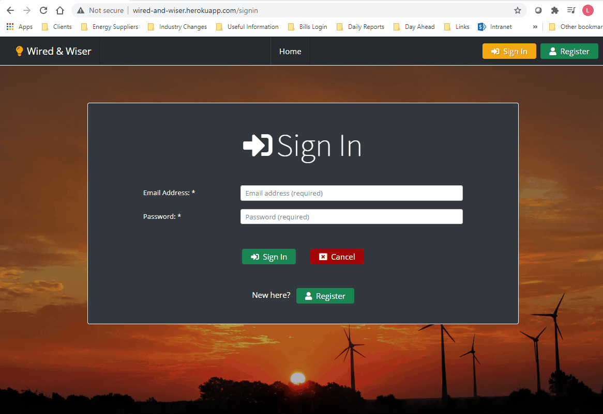

Submitting the Registration form when already signed in redirects the user to the Account page with the new account details so at least this doesn't result in an error -  the original user email address is replaced in the session variable by the new email address the user submits in the Register form.  However, this is not good for user experience; if a user is signed in and is able to reach the Register page, it could lead to a user inadvertently creating a second account with a different email address.  To solve this, I added an if statement to the **GET** method within the app.py file.  I check whether the user_email_address exists within the session variable - if so then I redirect the user to their Account page and display a flash message.  Otherwise the Register page is rendered.  I referenced [this solution](https://stackoverflow.com/questions/28925602/how-can-i-detect-whether-a-variable-exists-in-flask-session) I found following a Google search.  Users who are not signed in can still access the Register page.

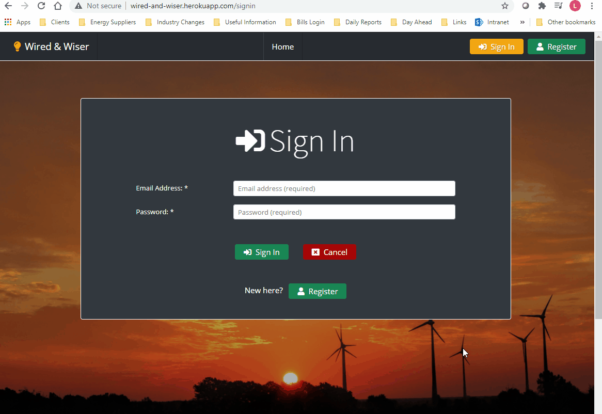

- **Sign In Page**:  The Sign In page had the same problem as the Register page; a user could sign in and still type in [this URL](http://wired-and-wiser.herokuapp.com/signin) and the Sign In page would load.  Once a user is signed in, they should not be able to return to the Sign In page.  Like with the Register page, if a signed in user signs in again, either with the same credentials or a different set of credentials, they are redirected to the Account page accordingly so no error occurs.  However, this is not good user experience.  I deployed the same solution to the (Python) signin function as I did to the register function.  Now when a signed in user tries to navigate to the signed in page, they are redirected back to the Account page and a flash message advises them that "You are already signed in as " and the user_email_address from the session variable.
- **Account Page**:  When testing the Account page, I encountered two serious errors.  The (Python) account function takes the users email address as an argument which forms part of the URL for the Account page.  Firstly, regardless of whether I am signed in or not, if I type the suffix "/account/" followed by a random string, an Attribute Error occurs and I am presented with an error screen.  This is because the account function in my app.py file searches the *users* collection for a record with the email address that has been entered and then I remove (**pop**) the password from it.  This code currently assumes that a record is returned when I search the *users* collection but when a random string is entered as the users email address and no results are found, then there is no dictionary to remove a password from.  Secondly, when I am already signed in, I can change the email address in the URL path to another email address that exists within my *users* collection and I am able to successfully see the Account information for another user:

Firstly, I decided to add an if statement to the (Python) account function which checks whether there is a user_email_address in the session variable.  If not, then the user is not signed in and so I don't want them to access the Account page.  Therefore, I redirect them to the Sign In page.

Next, I imported the regular expression module (**import re**) and check whether the string passed through to the account function is in the format of an email address.  I transform the username variable to all lower case and pass it to a new function called "validate_email".  I referenced [this solution](https://www.geeksforgeeks.org/check-if-email-address-valid-or-not-in-python/) to obtain the regex for validating email addresses.  If the string that has been passed to the account function is not in the correct format, the user is redirected to the account function but the user_email_address from the session variable is passed through.  Since the user is signed in, the correct user_email_address is retrieved from the session variable and they are redirected to their account page along with a flash message.

However, at this stage users can still enter strings which are in the format of an email address to pass the regex check I am performing.  If the string/email address they enter is not in the *users* collection then an error occurs.  If it is in the *users* collection then the Account page loads regardless of whether it is the same email address that the user is signed in with.

To resolve this, I then check whether the user email address passed through to the route in the username variable is equal to (matches) the user_email_address stored in the session variable.  If it doesn't, then the user is redirected to the account function but the user_email_address from the session variable is passed through.  This means that if a user types in another email email address into the URL other than their own, regardless of whether it is one which is in the *users* collection or not, they will be redirected to their Account page along with a flash message.

As one final piece of defensive design, I also check whether any result is returned when I use **find_one** method to search the *users* collection for the username that has been passed through.  In theory, by this point I have already validated that the username passed through matches the user_email_address that is in the session variable and therefore should absolutely exist in my *users* collection.  But just in case something goes wrong and it doesn't, then I redirect the user to the signout function meaning they are signed out and prevented from seeing any information that is not their own.

Below is a demonstration of the Account page following the above changes:

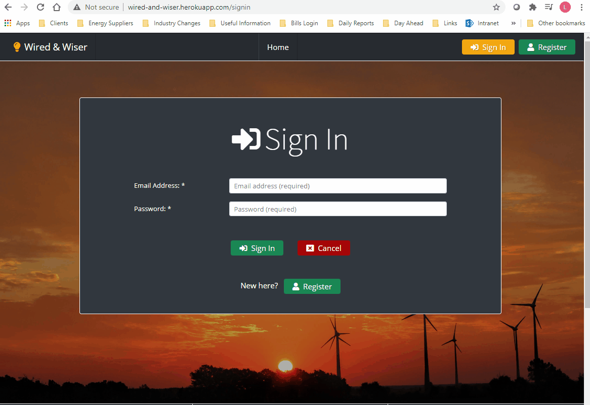

- **Booking Page**:  The Booking page should only be accessed by users who have already registered and signed in.  However, when testing, I discovered that a user who is not signed in can still reach the [Booking page](http://wired-and-wiser.herokuapp.com/book) even when they are not signed in.  If the user then completes and submits the form, it causes an error.  To resolve this, I added an if check to the (Python) book function which checks whether there is a user_email_address in the session variable.  This check is performed regardless of whether the method is **GET** or **POST**.  If there is no user_email_address in the session variable then the user is not signed in so I redirect them to the Sign In page along with a flash message advising them "Please sign in before trying to book a smart meter install".

- **View Booking Page**:  This page also has similar issues to the Account page.  Users should only be able to reach the View Booking page if they are signed in.  Furthermore, they should only be able to view booking they have made.  At the time of testing, neither of these holds true.  The (Python) view_booking function takes a booking_id as an argument which is appended to the URL.  Below is a screenshot showing how a user can view booking without being signed in, which isn't theirs and then also an error page which appears when an invalid booking_id is appended to the URL.

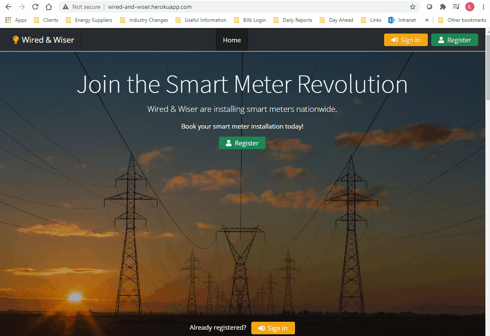

Firstly, I added an if statement to my (Python) view_booking function which checks whether a user is signed in by checking if there is a user_email_address in the session variable.  If not, then the user is redirected to the Sign In page along with a flash message.

Next, I validate whether the booking_id variable passed to the view_booking function is valid.  I referenced [this solution](https://stackoverflow.com/questions/28774526/how-to-check-that-mongo-objectid-is-valid-in-python) which requires bson to be imported (**import bson**) to set up the validate_id function.  I pass the booking_id variable to this function which returns true or false.  If an invalid booking_id has been passed, then I redirect the user back to the Account page along with a flash message.

I use the **find_one** to find a record in the *meter_installs* collection with the corresponding booking_id.  Finally, I check whether a record is returned **and** whether the user_email_address in the record matches the one saved in the session variable.  This ensures that users can only view their own bookings and not another users.  If either no record is found in the *meter_installs* collection or the user_email_address differs from the one in the session variable, the user is redirected to their Account page along with a flash message informing them "The booking ID you are trying to find is not valid".

- **Update Booking Page**:  When I tested the Update Booking page, the same issues existed as they did with the View Booking page.  Users who are signed out can access the page, users can access the Update Booking page for bookings which aren't theirs and if an invalid booking_id is passed through to the (Python) update_booking function, then an error occurs:

I deployed the same steps on the (Python) update_booking function as I detailed above on the view_booking function.  The end result is demonstrated below and is as desired:

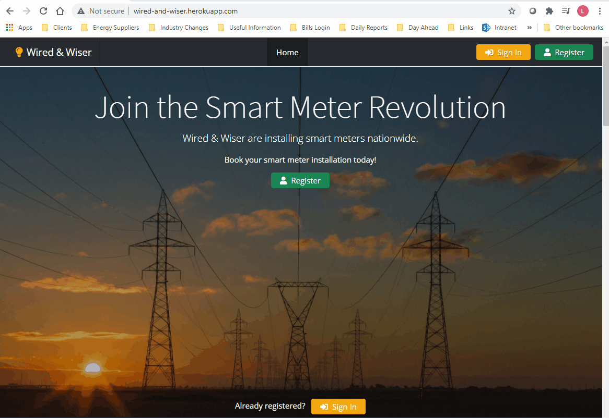

- **Update Account Page**:  The (Python) update_account function takes a vavriable called username as an argument - this is expected to be a users email address.  This is also apended to the URL.  If a user is not signed in, then trying to reach the Update Account page by typing in the URL results in an error, regardless of whether a valid email address is passed through.  When signed in, if an invalid email address is passed through, an error also occurs.  However, if a valid email address is passed through, the Update Account page loads, regardless of whether the email address is the users or not.  Therefore, one user could sign in and then access the Update Account page of another user.  None of these things should happen:

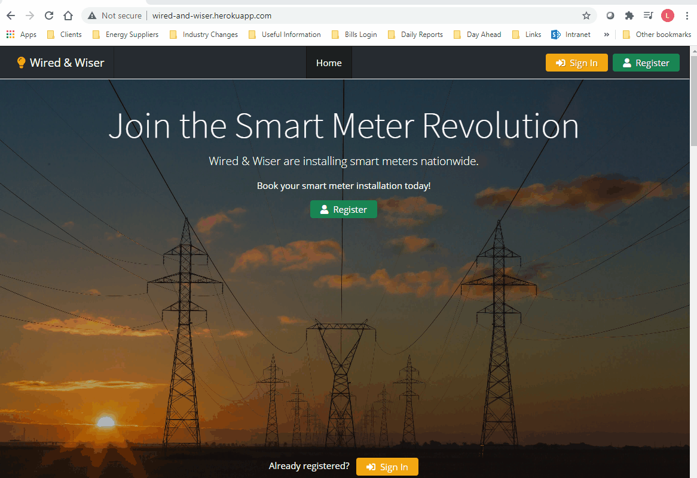

I addded a check to see whether the user is signed in and if not, redirect them to the Sign In page along with a flash message.  Next I use the validate_email function to validate whether an email address has been passed to the update_account function.  If not then I redirect the user to their Account page along with a flash message.  Next, I search the *users* collection for a record with a user_email_address corresponding to the username that has been passed through.  Finally, I check whether a record is found **and** whether the user_email_address in the record matches the one saved in the session variable.  If not, then again the user is redirected to the Account page with a flash message.  This prevents users from reaching the Update Account page with another users email address passed through as the variable:

- **Page Not Found**:  When a user enters the URL with an unexpected suffix, then no webpage result is found.  For example, entering "http://wired-and-wiser.herokuapp.com/test" doesn't render any templates.  Originally, this resulted in the below page being displayed:

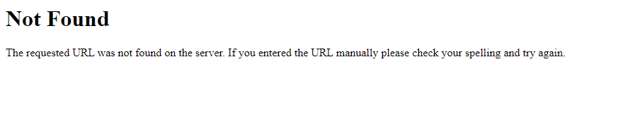

There are infinite suffixes a user can type which will result in no page being found on my website, known as a 404 error.  By referencing the [Flask documentation](https://flask.palletsprojects.com/en/master/errorhandling/), I found a solution which handles 404 errors and instead directs users to a page I have created and thus have control over.  I created the template 404.html file and added an errorhandler(404) function in my app.py file.  Now, anytime a user tries to load a page which doesn't exist, they are redirected to my 404.html page which informs them that something went wrong and suggests they return to my Home page:

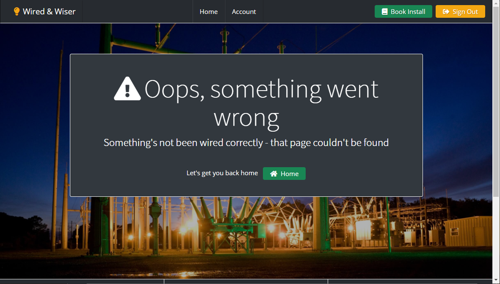

#### Forms

Aim:  All forms should work as expected - namely the **POST** methods in my Python functions pass valid data to the database.  Users should not be able to submit forms with invalid data in fields or required fields missing.

Methodology:  I will test each form in turn to ensure that users cannot submit invalid data and that when the website handles situations where users attempt to submit invalid data.  To do this, I will isolate each field in turn by ensuring valid data is entered in all other fields.  I will also review the backend (Python) code in my app.py file.  Up to now, I have utilised the front end (HTML5) to apply data restrictions to the input fields.  However, from conversations with my mentor, I understand that these can be easily bypassed thus it is critical that backend validation of data takes place.

The following pages have forms which **POST** data:
- Register Page
- Sign In Page
- Booking Page
- Update Booking Page
- Update Account Page

Furthermore, I will test that the Delete Booking and Delete Account functions work correctly.  These fucntions do not **POST** data to my database but they do delete data from it so it is equally important I validate them.

Results:
- **Register Page**:  I added some checks in the **POST** method of the (Python) register function.  This function now validates the data the user submits to ensure it matches the format requested.  The first and last names are passed to the validate_name function and the email address is passed to the validate_email function.  The password is passed to the validate_pw function - I only check the length of the password and do not restrict characters that the user can input since the password is hashed before it is passed to my database removing the risk on any malicious code being inserted into my database.  If any of these validation tests results in a False result being returned, then the user is redirected to the Register page and a flash message informs them what invalid data they have entered.  I have applied the same validation attributes to the input fields in the HTML5 code so the Python checks will only trigger if the user bypasses the frontend validation rules.  The following inputs result in the form not being submitted:
    - Leaving any required field blank.
    - First or last name containing any numbers or special characters aside from a hyphen (-).
    - First or last name being longer than 30 characters.
    - Invalid email format.
    - Email address already exists in *users* collection.
    - Password shorter than 6 characters or longer than 15 characters.

If all fields validate, a record is inserted into the *users* collection and the user is redirected to the Account page.

If a user is already signed in, they cannot access the Register page and are instead redirected to their Account page.

- **Sign In Page**:  The email address and password fields are validated by both the frontend (HTML5) and backend (Python) signin function.  The following inputs result in the form not being submitted:
    - Leaving any required field blank.
    - Invalid email format.
    - Password shorter than 6 characters or longer than 15 characters.
    - Email address doesn't exists in *users* collection.
    - The password doesn't match the corresponding record in the *users* collection.

If both fields validate, the user is signed in.  Their email address is stored in the session variable.  The user is redirected to the Account page.

If a user is already signed in but tries to access the Sign In page, they are redirected to the Account page.
    
- **Booking Page**: As I was testing this form I discovered that I could submit a new booking for a meter ID that already exists in the *meter_installs* collection.  I soon realised that an earlier change meant that the meter ID's were stored in my *meter_installs* collection as integers.  But when I performed my **find_one** search, I took the user input from the form to check for an existing record with the same meter ID but I did not convert the form input into an integer.  As a result, I was searching my *meter_installs* collection for a meter ID in a string format despite them all being stored as integers.  Thus the check always returned false and a new record was inserted into the collection.  By converting the user input into an integer before searching for a record with the same meter ID, I resolved the issue.  This means users cannot enter a new booking for a meter ID where a record already exists with that meter ID in the *meter_installs* collection.

I also perform several checks on the data which has been input.  Where I have a **required** attribute set on an input field in the HTML5, I check whether there is a value and whether it passes a validation check (I have several validation functions to check for different types of input).  Despite several of the frontend (HTML5) input fields having the **required** attribute set, I understand that this can be bypassed.  Therefore, I perform a check in the backend (Python) function to ensure that there is actually a value in the form that is submitted.  Not all fields are required so for those, I check whether there is a value and if so, then check it by calling the appropriate validation function.

The textarea input fields for the meter location and access instructions cannot have a **pattern** attribute applied to them to validate the input data.  Therefore there is only backend data validation which permits letters, numbers, spaces and full stops.

Entering any of the following will prevent the form from being submitted:
    - Leaving any required field blank.
    - Entering anything other than a 13 digit number in the meter ID field.
    - Entering a meter ID which already exists in the *meter_installs* collection.
    - Any non-alphanumeric characters in the meter serial number input or a string of length greater than 12 characters.
    - Any non-alphanumeric characters in the address first, second or third line inputs or a string of length greater than 50 characters.  Spaces are allowed.
    - Any non-alphanumeric characters in the town or county inputs, spaces are allowed.
    - Any non-alphanumeric characters in the postcode input.  Spaces are allowed.  Lengths shorter than 6 characters or longer than 8 characters will be rejected.
    - Any non-alphanumeric characters in the meter location and access instruction inputs.  Spaces and full stops are accepted.
    - Any string/input other than "yes" or "no" in the parking_on_site input is rejected.
    - Any string/input other than "residential" or "commercial" in the property_type input is rejected.
    - Any non-alphanumeric characters in the supplier inputs or a string of length greater than 30 characters.  Spaces are allowed.
    - Any non-alphanumeric characters in the supplier account number inputs or a string of length greater than 20 characters.  Spaces and forward slashes (/)are the only non-alphanumeric characters permitted.
    - Only numbers are permitted in either of the meter read inputs with a maximum length of 8 digits.
    - Only numbers and forward slashes (/) are allowed in the installation date input.  The length must be 10 characters.  Using the datepicker as mentioned above limits what can be input.

If an invalidate input is provided, the Booking page is reloaded and a flash message informs the user what the issue was.

If all fields validate, a record is inserted in the *meter_installs* collection.  The user is redirected back to their Account page.

If a user is not signed in but tries to access the Booking page, they are redirected to the Sign In page.

- **Update Booking Page**:  The Update Booking form has the same validation applied to it as the Booking page.  Since it is possible that a user tries to change the meter ID for their booking, I reject the form if the new meter ID already exists as a record in the *meter_installs* collection.

One change I did make as I was testing the Update Booking page was to the behavious of the Update Booking modal.  Previously, if the user tried to submit the form with data which doesn't pass the HTML5 validation, then a warning appears in screen.  However, the Update Booking modal still remained on screen partially obscuring the view of the form and warning message.  I added some jQuery to close the modal when the user clicks the "Yes - Update My Booking" button.

If an invalid input is provided to the backend, the data validation checks will prevent this being passed to the database - the Update Booking page is reloaded and a flash message informs the user what the issue was.

If all fields validate, the record is updated in the *meter_installs* collection.  The user is redirected back to their Account page.

If a user is not signed in but tries to access the Update Booking page, they are redirected to the Sign In page.  If a user is signed in but tries to access the Update Booking page for a booking which isn't on of theirs, they are redirected to the Account page.

- **Update Account Page**:  The Update Account has the some front and backend validation checks performed on user inputs as the Registration page.  The following will result in the form not being submitted:
    - Leaving any required field blank.
    - First or last name containing any numbers or special characters aside from a hyphen (-).
    - First or last name being longer than 30 characters.
    - Invalid email format.
    - If the user updates their email address to one which already exists in the *users* collection, the form will be rejected.
    - Password shorter than 6 characters or longer than 15 characters.

If all fields validate, the users record is updated in the *users* collection.  The user is redirected back to their Account page.

If a user is not signed in but tries to access the Update Account page, they are redirected to the Sign In page.

- **Delete Booking**:  

- **Delete Account**:  

#### User Stories

#### Valid Code

#### Google Lighthouse Tool

### Database Schema

I decided to store the meter ID and meter reads as integers since only numbers can be entered into these fields.  The supplier authorisation field didn't necessarily need to be stored in the *meter_installs* collection since the user has to tick this input before they are able to submit the form and thus insert or update the record into the collection.  However, I chose to store this as a value in the collection anyway as a boolean value.

Where fields aren't required, empty strings are passed through to the collections with the exception of the meter read values which are entered as None if no value is provided.

As mentioned previously, despite the "_id" fields being unique, the user_email_address is a unique field in the *users* collection and the meter_id is a unique field in the *meter_installs* collection.

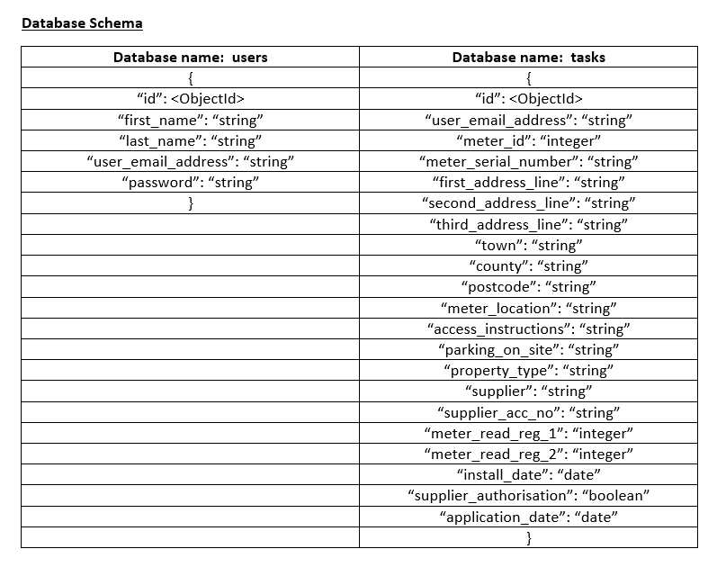

## Deployment

### Setting Up The Database

My database is hosted my MongoDB which is a document-based (rather than table-based) database service (aka NoSQL).  I signed up for a free account and created a cluster called myFirstCluster.  Within this I created a database called *wired_and_wiser*.  Within this database I created two collections: *users* and *meter_installs*.  The users email address is the primary key in the *users* collection and the meter id is the primary key in the meter_installs collection.  It is worth noting that MongoDB also automatically generates a unique id for each document in the collections with a key of “_id”.

### GitPod Environment

I used the [Code Institute GitPod](https://github.com/Code-Institute-Org/gitpod-full-template) template to create [my GitHub repository](https://github.com/LukeGarnham/Wired-and-Wiser-MS3) which I called “Wired-and-Wiser-MS3”.  I opened my repository up in GitPod to start building my project.

The first thing I did to set up my GitPod environment was install Flask in the command terminal using the command **pip3 install Flask**.  Next I created a file called app.py for my Python app (**touch app.py**).  Then, I created a Python file to contain my environment variables called env.py (**touch env.py**).

The file called env.py is used to store confidential data so this must not be pushed to GitHub.  To ensure a file is not pushed to GitHub, list the file name in a file called .gitignore.  The Code Institute template already contains a .gitignore file with env.py and __pycache__ listed within it.  If the .gitignore file didn’t exist I would have created it (**touch .gitignore**) and listed both env.py and __pycache__ within it.

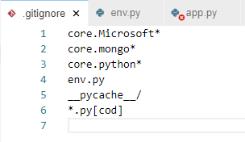

Within the env.py file, I **import os** and set my environment variables: IP (0.0.0.0), PORT (5000), SECRET_KEY, MONGO_URI and MONGO_DBNAME (wired_and_wiser).

For the MONGO_URI variable, I went to the Overview tab within the MongoDB cluster dashboard.  I clicked on Connect and then in the modal, clicked the Connect your application button:

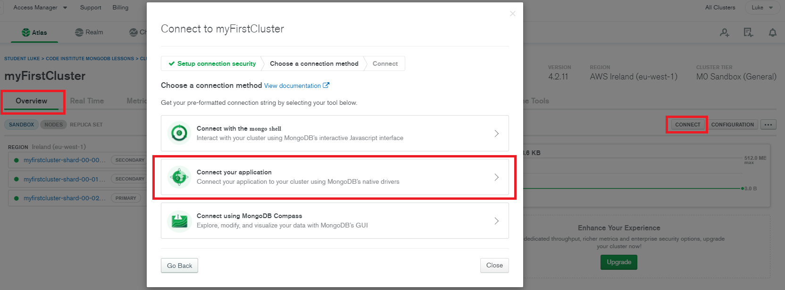

From here, ensuring that the selected driver is Python, I copied the application code:

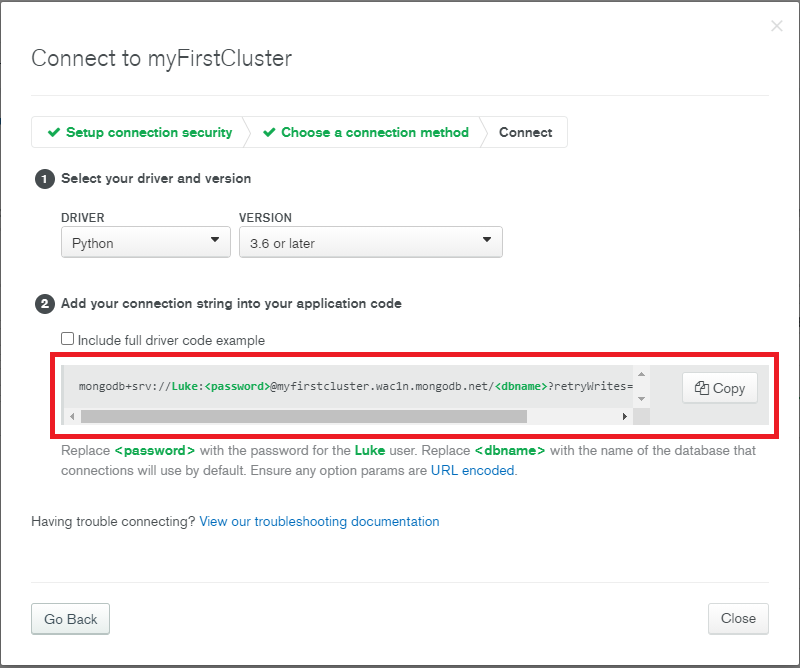

I pasted this code into the env.py file such that it is the value to the MONGO_URI key.  Within the pasted code, I replaced the < password > placeholder text with the password for my cluster and replaced the < dbname > placeholder text with the database name (*wired_and_wiser*).

### Create the Flask Application

Within the app.py file I **import os** and **from flask import Flask**.  When the app is running in GitPod, the environment variables must be imported from the env.py file.  I create an instance of Flask in a variable called app within the app.py file.

### Deploy Application to Heroku

In order for Heroku to run the Flask application, it needs to know what dependencies the app has.  The requirements.txt file is created to list the dependencies using the command **pip3 freeze –local > requirements.txt**.

Heroku also needs to know which file runs the app.  To do this, a Procfile is created using the command **echo web: python app.py > Procfile**.  Any blank lines at the bottom of the Procfile should be deleted.

I signed up for a free account at [Heroku.com](https://www.heroku.com/).  Once logged in, I created a new app which I named wired-and-wiser.  In the Deploy screen, I selected GitHub and found my “Wired-and-Wiser-MS3” repository:

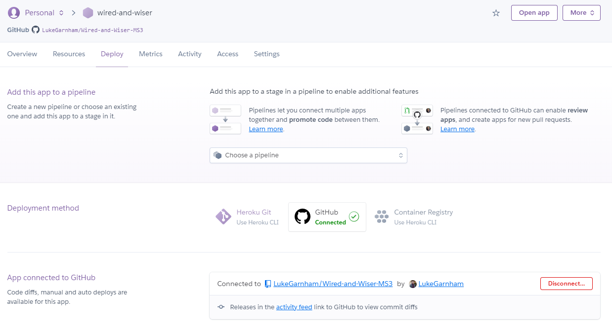

Next, within the Settings section on Heroku, I created the Config Vars.  These were the same key-value pairs I set up as environment variables within the env.py file.  Since the env.py file is not pushed to GitHub, they must be set up as Config Vars as Heroku still needs to know the environment variables.

Back in GitPod, each of the files that have been created above within the GitPod environment were pushed to the GitHub repository except for those listed in the .gitignore file.  Then back within the Heroku app dashboard, I enabled automatic deploys.  This means that any time I update my project in GitPod and push the changes to GitHub, Heroku will automatically deploy the most recent update.  Finally, I deployed the Master Branch.  After a few moments I received the message “Your app was successfully deployed.”  The deployed site is now available and can be accessed via https://wired-and-wiser.herokuapp.com/.

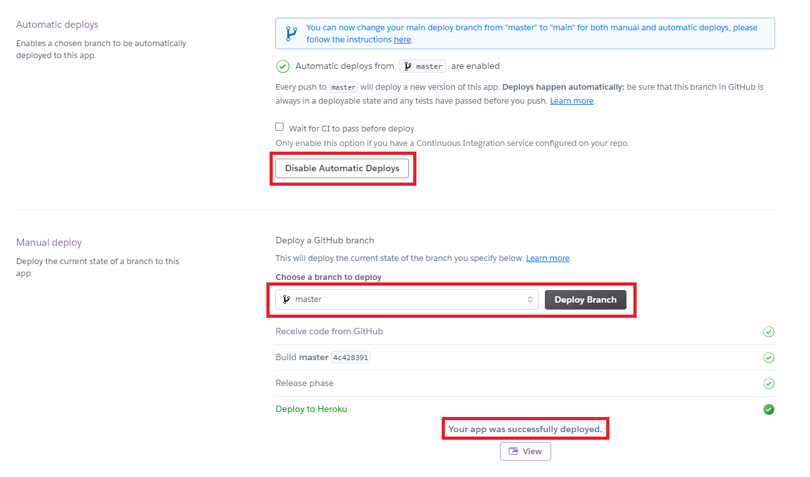

### Connecting Flask Application to MongoDB Database

Next, I connected my MongoDB database to my Flask application.  In GitPod, I installed flask-pymongo library (**pip3 install flask-pymongo**).  Then I installed a package called dnspython (**pip3 install dnspython**).  Each of these packages need to be added to the requirements.txt file so that Heroku knows which packages to install (**pip3 freeze –local > requirements.txt**).

Within the app.py file, I imported **from flask_pymongo import PyMongo** and **from bson.objectid import ObjectId**.

Next I configured my app so that the app variables MONGO_DBNAME, MONGO_URI and SECRET_KEY are equal to the environment variables.  Then I created an instance of the PyMongo app.

#### Using Flask Template Inheritance

Within the GitPod environment, I created a folder called templates.  Flask looks in this folder to build the webpages using the render_templates function.  I created a base.html file which contains content which remains consistent across the website such as the header and footer.  The other pages use this template but inject different content depending on the purpose of each page.

## Credits

### Content

A portion of the content on the home page was copied from the [Which? guide to smart meters](https://www.which.co.uk/reviews/smart-meters/article/smart-meters-explained/what-is-a-smart-meter).  I used this website to inform some of the content I wrote myself.  I put a link to this guide into my home page because I think users of my website might find the extra reading useful.  The link opens the Which? guide in a new tab.

I also inserted a link on my home page to the [Energy Saving Trust’s energy saving tips webpage](https://energysavingtrust.org.uk/hub/quick-tips-to-save-energy/) as I think this would be useful additional reading for visitors to my website.  The link opens the webpage in a new window so that users are not navigated away from my website.

### Media

[FontAwesome](https://fontawesome.com/) – I used the icons available on Font Awesome to improve UX.
[FavIcon Generator](https://www.favicon-generator.org/) - I used this website to generate the FavIcon files and links.

#### Images

Jumbotron image – The image I used for the jumbotron on the home page was sourced from [Unsplash.com](https://unsplash.com/photos/yETqkLnhsUI).

Home page images – The images used on the homepage were taken from various free sources:
- The image of an energy meter on the home page was sourced on pixabay.com.  [Here is the image source](https://pixabay.com/photos/meter-electrical-meter-power-3410068/).
- The image of the Earth on the home page was sourced on unsplash.com.  [Here is the image source](https://unsplash.com/photos/Q1p7bh3SHj8).
- The image of the solar panels on the home page was sourced on pexels.com.  [Here is the image source](https://www.pexels.com/photo/black-and-silver-solar-panels-159397/).
- The image of the light bulb on the home page was sourced on pexels.com.  [Here is the image source](https://www.pexels.com/photo/clear-light-bulb-planter-on-gray-rock-1108572/).

The background image on the Register page shows wind turbines and was sourced on unsplash.com.  [Here is the image source](https://unsplash.com/photos/0w-uTa0Xz7w).

The background image on the Sign In page shows wind turbines and was sourced on pexels.com.  [Here is the image source](https://www.pexels.com/photo/afterglow-backlit-dawn-dusk-290527/).

The background image on the Account page shows electricity pylons and was sourced on pexels.com.  [Here is the image source](https://www.pexels.com/photo/sky-sunset-sun-twilight-46169/).

The background image on the Book Meter Install page shows a wind turbine and was sourced on unsplash.com.  [Here is the image source](https://unsplash.com/photos/9HEY1URQIQY).

The background image on the View Booking page shows a wind turbine and was sourced on pexels.com.  [Here is the image source](https://www.pexels.com/photo/backlit-clouds-dark-dawn-210267/).

The background image on the Update Booking page shows a wind turbine and was sourced on pexels.com.  [Here is the image source](https://www.pexels.com/photo/wind-turbines-during-golden-hour-2673471/).

The background image on the Update Account page shows a wind turbine and was sourced on pexels.com.  [Here is the image source](https://www.pexels.com/photo/20-fenchurch-street-backlit-clouds-dawn-358092/).

The background image on the 404.html (page not found) page shows a transformer and was sourced on unsplash.com.  [Here is the image source](https://unsplash.com/photos/AA5v6sMcalY).

On the Meter ID modal, there are two images:
- The image of the Meter ID was found using Google and taken from [this website](https://lookaftermybills.com/blog/how-do-i-find-my-mpan-number/).
-	The map of the Distribution Network Operators was also found using Google and was taken from [Ofgem’s website](https://www.ofgem.gov.uk/key-term-explained/map-who-operates-electricity-distribution-network).

The Meter Serial Number modal contains an image which I found on [this website](https://www.nabuhenergy.co.uk/meter-serial-number/) via a Google search.

##### Reducing File Size of Images

Tinyjpg.com – In order to optimise the loading times on my website, I reduced the original file size of my images using www.tinyjpg.com.  In total, this reduced the file size of the images on my website by 6MB, a 58% reduction:

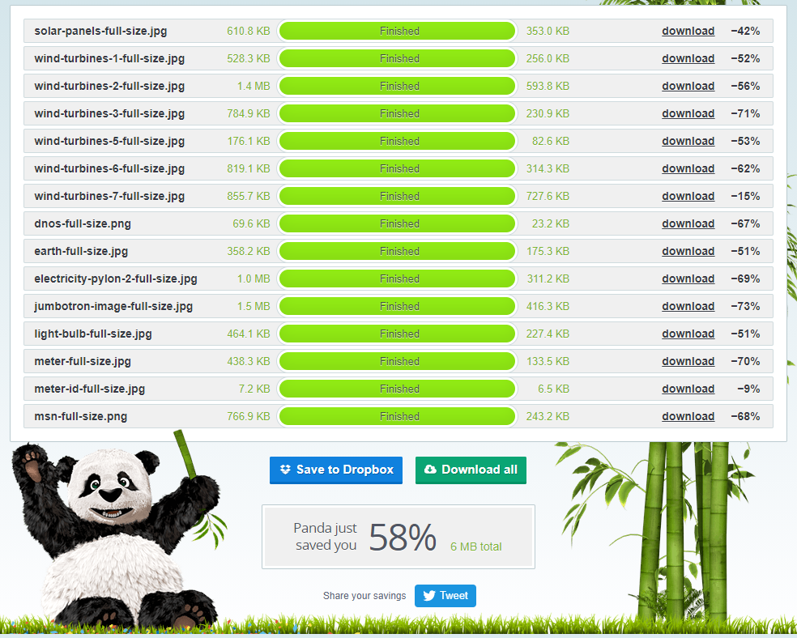

### Acknowledgements

NavBar – The HTML code for the **nav** element was initially copied from [Bootstrap](https://getbootstrap.com/docs/4.5/components/navbar/#toggler).  This gave me the basis of a navigation bar which contained navbar links behind a toggle button which is positioned to the right but on large-devices (992 pixels width upwards), the navbar links then all appear positioned to the left.  I significantly modified this copied code to achieve the navigation result in my final project.

Jumbotron – The code for the jumbotron was initially copied from [Bootstrap](https://getbootstrap.com/docs/4.5/components/jumbotron/) although the code was altered and added to significantly to achieve the final result in the project.  A background image was applied with a mask over the top to help the text I overlaid on the image standout better.  To help me position the Sign In button to the bottom of the jumbotron I referenced [this solution](https://medium.com/front-end-weekly/absolute-centering-in-css-ea3a9d0ad72e).

I used jQuery to configure the authorisation button on the Booking and Update Booking forms such that the submit form button is disabled unless the user ticks the authorisation option. To achieve this I referenced [this solution](https://stackoverflow.com/questions/7031226/jquery-checkbox-change-and-click-event).

On the Booking and Update Booking forms, I included a datepicker widget which I got from [jQuery UI](https://api.jqueryui.com/datepicker/).  I referenced [this solution](https://stackoverflow.com/questions/31770976/disable-specific-days-in-jquery-ui-datepicker) to disable Sunday's and prevent users selecting them as an installation date.

On the Account page, the code for tabs was originally copied from [Bootstrap](https://getbootstrap.com/docs/4.5/components/navs/#javascript-behavior).

When a user updates their account details, if they change their email address I need to update their email address for all meter install records they've booked in the *meter_installs* collection.  To do this, I referenced [this solution](https://www.w3schools.com/python/python_mongodb_update.asp).